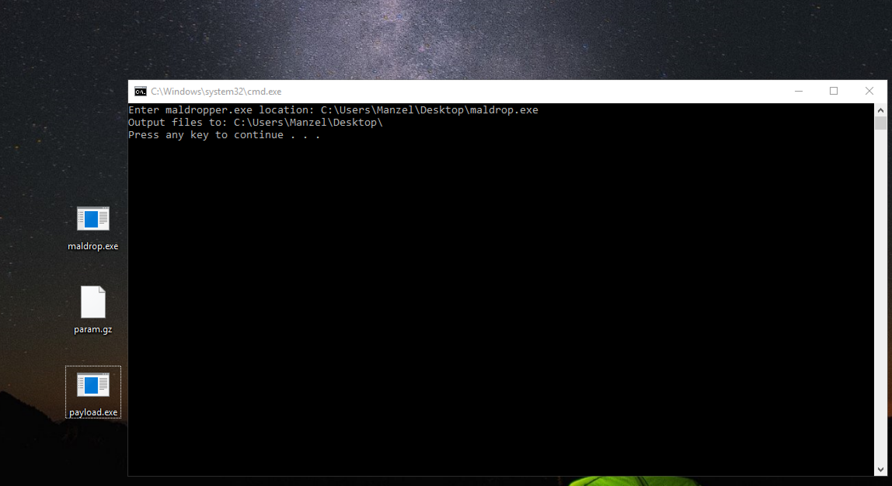

# MalDropper
Reverse Engineering - 160 points

## Challenge 
> Mind looking at this malware dropper I found?

>[File](maldrop.exe)

> Note: this isn't actually malware, it just borrows obfuscation techniques from low quality malware.

## Solution

Using `strings` we can see this is a NET Framework app.

Decompile using JetBrains dotPeek.

#### Part 1: maldrop.exe

> Decompiled code: [maldrop_decompiled.cs](./part1/maldrop_decompiled.cs)

Let's understand what it does

1. print "All the techniques implemented ..."
2. read file assembly
3. split the assembly using `[SPLITERATOR]`
4. in the split array: `[1]` contains the [COFF object code](https://en.wikipedia.org/wiki/COFF), `[2]` contains the parameter passed in
5. finally, call [`Assembly.Load(...).EntryPoint.Invoke()`](https://docs.microsoft.com/en-gb/dotnet/api/system.reflection.assembly?view=netframework-4.7.1)

This means that index `[1]` contains another program.

If I look at the bytes in `numArray[1]`, we see the new program is called `payload.exe`

Write the following C# code to retrieve out the new program and also the parameter values.

	File.WriteAllBytes(dirname + "payload.exe", numArray[1]);
	File.WriteAllBytes(dirnname + "param.txt", numArray[2]);

> Retriving program: [output_files.cs](./part1/output_files.cs)
> 

---

#### Part 2: payload.exe

> Decompiled code: [payload_decompiled.cs](./part2/payload_decompiled.cs)

Similarly, let's analyse `payload.exe`

1. Take in the params as byte array
2. Decompress using gzip
3. Call `Assembly.Load(...).EntryPoint.Invoke()` again.

Hence, let's just rename `param.txt` to `param.gz` and `gunzip` it.

Using `strings`, the new program is called `flagbuilder.exe`

---

#### Part 3: flagbuilder.exe

> Decompiled code: [flagbuilder_decompiled.cs](./part3/flagbuilder_decompiled.cs)

Finally we have the flag, but it is not printed. Add in this line...

	Console.WriteLine("Flag is: " + stringBuilder.ToString());

> Flag printed: [print_flag.cs](./part3/print_flag.cs)

Run it and success!

	Flag is: easyctf{12761716281964844769159211786140015599014519771561198738372}
	Press any key to continue . . .

## Flag
`easyctf{12761716281964844769159211786140015599014519771561198738372}`