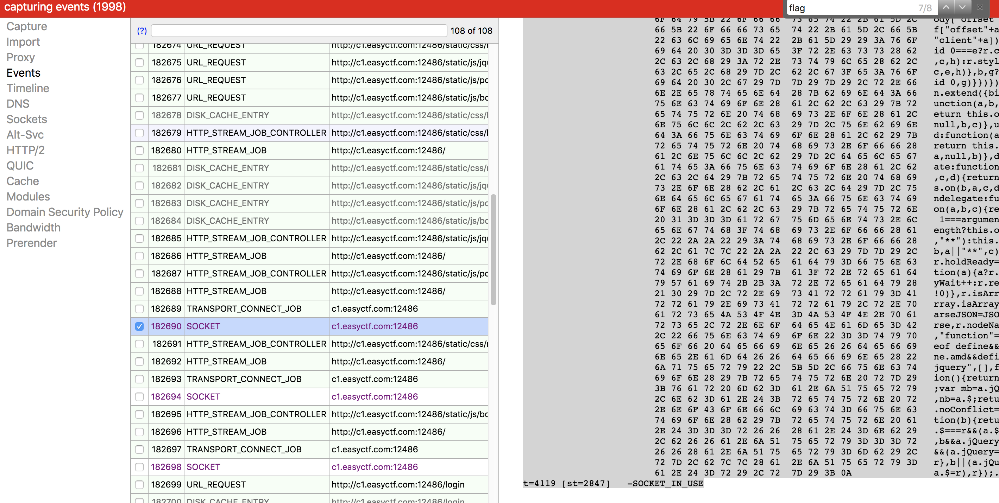

# Nosource
Web - 250 points

## Challenge 
> Written by gengkev

> All you CTFers are sure getting on my nerves with your source-viewing and developer tools-ing! Alas, despite my best wishes, the experienced programmers on the wonderful website StackOverflow tell me that it's [impossible](https://stackoverflow.com/q/6597224/689161) to keep you from looking at the HTML. But a disable right click script certainly won't stop an experienced CTFer like you! So finding the flag in the source of this problem should be no trouble, [right](http://c1.easyctf.com:12486/)?

## Hint
> If you can't beat 'em, maybe you can get around 'em somehow?

## Solution
When opening dev tools, the page reloads and shows the ["Uh oh, you've been Soup'd!"](http://c1.easyctf.com:12486/soupd?12) (ie. the page reloads upon opening dev tools).

Hence we need another way to get the source code.

### Part 1
#### Extract Source Code (Method A)
A quick way is to use Javascript bookmarklets to copy out the source.

    var sourcecode = document.getElementsByTagName('html')[0].innerHTML;
    var myWindow=window.open('');
    myWindow.document.write(sourcecode);

    // window.alert(sourcecode); 
    // can't use dialog since alert dialog truncates long texts.

[Use this website to convert to bookmarklet form](https://mrcoles.com/bookmarklet/).

    javascript:(function()%7Bvar%20sourcecode%20%3D%20document.getElementsByTagName('html')%5B0%5D.innerHTML%3Bvar%20myWindow%3Dwindow.open('')%3BmyWindow.document.write(sourcecode)%7D)()

#### Extract Source Code (Method B)
Alternatively, use a Chrome extension to see the source code. [Quick source viewer](https://chrome.google.com/webstore/detail/quick-source-viewer/cfmcghennfbpmhemnnfjhkdmnbidpanb/related)

### Part 2
#### Analysis of source code
> [sourcecode.html](sourcecode.html)

Unfortunately, unlike `Nosource Jr`, we can't see the base64-encoded flag. Seems like the original `<script>` has been removed before we got to the source code.

#### Sniffing the packets

I thought of sniffing for the raw packets to get the source code.

Fortunately, Chrome provides a tool: `chrome://net-internals/`

Start capturing, then click on the `Login` button. 

The above shows the packet which is responsible for it.

>[socket_event.txt](socket_event.txt)

### Part 3
#### Getting the flag!!!

We found the things needed from the (real) source...

> [socket_event-source.html](socket_event-source.html)

    var formEl = document.getElementById('flag-form');
    var inputEl = document.getElementById('flag');

    var func = "(function (e, v) { e.preventDefault() || " +
        "alert(inputEl.value === process(this.prototype.flag, " +
        "this.prototype.key) ? 'Your flag is correct!' : " +
        "'Incorrect, try again.'); })";
    var f = 'DQ4cJgsbCVofB18sNw4wRlhfCwAbXxpTC1wwKVlcGBIaUDAGJzowYDoqTiI=';
    var p = { prototype: { flag: atob(f), key: 'heheheh!' }};

Now since we can't open dev tools to get to the console, let's use Javascript bookmarklets again.

    var flag = 'DQ4cJgsbCVofB18sNw4wRlhfCwAbXxpTC1wwKVlcGBIaUDAGJzowYDoqTiI=';
    var payload = process(atob(flag), 'heheheh!');
    alert(payload);

Make a bookmarklet out of this code and run it and we get the flag!

## Flag
`easyctf{wh0s_a_g00d_s0urc3_v13w3r?_YOU_ARE!}`