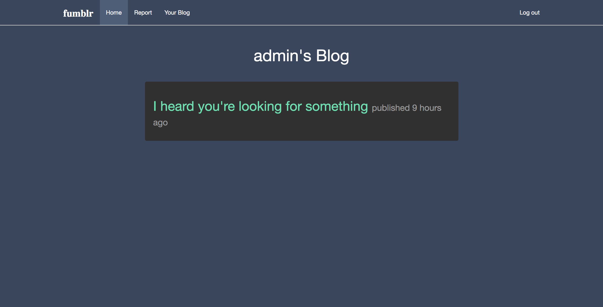
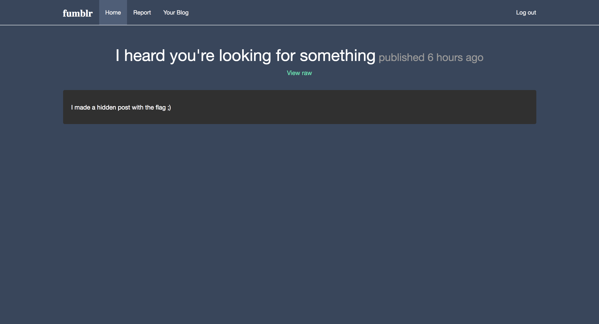
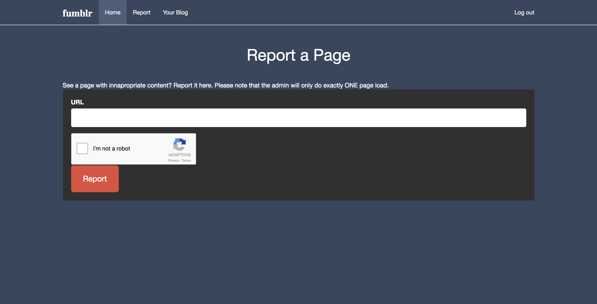

# fumblr
Web - 275 points

## Challenge 
> Come check out the latest blogging platform all the cool kids are using! I tried my hardest to make it hack-proof. If you can read the admin's hidden posts, I'll even give you a flag!! Good luck!?

> http://c1.easyctf.com:12491/

## Hint
> you wish

## Solution

#### Analysis
The blog will have the following URL format:
	
	http://c1.easyctf.com:12491/blog/<username>

Let's visit the [admin's blog](http://c1.easyctf.com:12491/blog/admin)

We need to find that hidden post. The hex string in the URL might be the ID of the post
When trying out, we see that raw HTML placed in the Contents will come out parsed.

We can do some XXS, in which we can make the admin visit via the report page!

#### XSS techniques?

I tried the following with failure...

	

	<iframe name="iFrameName"></iframe>

It seems that the XSS requires the page loaded to be from the same website

#### Recon

Looking through the usernames list, I found another team's blog (username=`zip`) which had the correct answer.
(Sorry for stealing your answer, hehe)

From here: http://c1.easyctf.com:12491/blog/zip/5a8a2c67c412df2a000121f5

	t5
	

And from here: http://c1.easyctf.com:12491/blog/zip/5a8a2c59c412df2a000121f3/raw

	(See answer.js)

Apparently what it does is they placed valid JS such that when loading the raw page, the XSS executes by:
1. copying all the admin's post links
2. posting the contents as a base64 string using `XMLHttpRequest`

With this, we make report the post and the admin will execute one page load...

This posts a link on the blog with the base64 payload

http://c1.easyctf.com:12491/blog/zip/5a8a37a8c412df2a00012263

	$ echo 'aHJlZj0iL2Jsb2cvYWRtaW4vNWE4OWMyMzBjNDEyZGYyYTAwMDExNTYzIj5Zb3VyIGZpcnN0IFBvc3QKaHJlZj0iL2Jsb2cvYWRtaW4vNWE4OWMxNzJjNDEyZGYyYTAwMDExNTU3Ij5JIGhlYXJkIHlvdSYjMzk7cmUgbG9va2luZyBmb3Igc29tZXRoaW5nCmhyZWY9Ii9ibG9nL2FkbWluLzFiNDNjMTgyYzQzNGRmMmE0MzUxMTU2MSIRmxhZwo=' | base64 --decode 

	href="/blog/admin/5a89c230c412df2a00011563">Your first Post
	href="/blog/admin/5a89c172c412df2a00011557">I heard you&#39;re looking for something
	href="/blog/admin/1b43c182c434df2a43511561"?Y

Now, [visit the hidden post](http://c1.easyctf.com:12491/blog/admin/1b43c182c434df2a43511561) and we see the answer...

## Flag
`easyctf{I_th0ght_CSP_m4d3_1t_s3cur3?}`